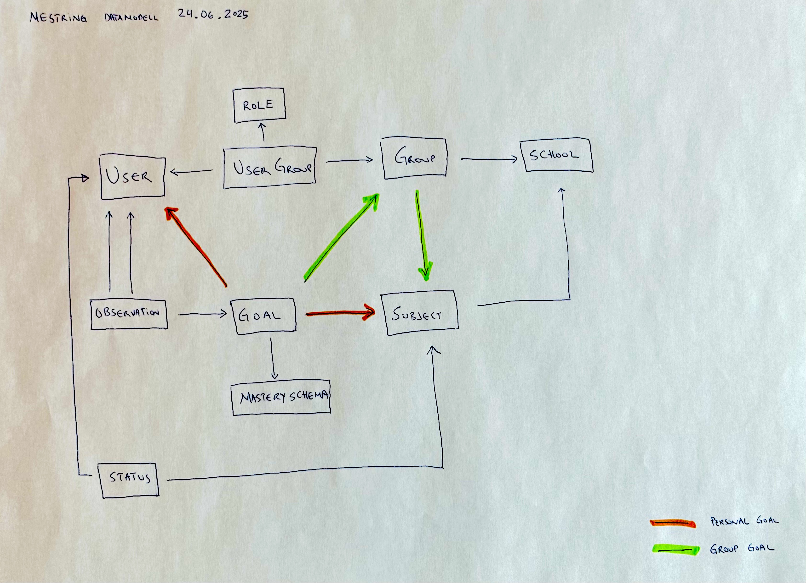

This issue sketches up a plan for the lifecycle of our various pieces of data.

# Model infrastructure

All models have, via `Basemodel`, have these fields:

- `maintained_at` - Timestamp is updated each time the Feide import job creates or updates something, e.g. `Group`, `UserGroup`, `User`.
- `deleted_at` - A "soft delete" flag. When this is set, the row is invisible to users unless a specific parameter is sent with the request. When this timestamp is 90 (or some other number) days old, the system will remove this row from the database ("hard delete"), see deletion below.

Additionally, groups from Feide have `notBefore` and `notAfter` fields which are persisted in the `Group` table as:

- `valid_from` - If current date is less than this value, the `Group` (and thereby user_groups/memberships) is invisible to users unless a specific param is sent with the request.
- `valid_to` - If current date is greater than this value, the `Group` (and thereby user_groups/memberships) is invisible to users unless a specific param is sent with the request.

**Note**: `UserGroup` rows (memberships) should not be visible if the associated `Group` is outside the `valid_from` <--> `valid_to` scope.

**Note**: `Goal` rows should not be visible if the associated `Group` is outside the `valid_from` <--> `valid_to` scope. This only removes group goals from visibility. Personal goals will still be visible. Is this correct behavior❓

# Herding data through their respective lifecycles

_Easy come, not so easy go._

## Create and update

The daily Feide import job operates on school level. It happens in five stages, each of these stages are orchestrated by a row in the `DataMaintenanceTask` table:

1. **Fetch groups**: For the school in question, fetch all groups from Feide and store them in a sanitized `groups.json` file, ordered by group type (teaching, basis etc).
2. **Fetch memberships**: Based on the content of `groups.json`, fetch from Feide all members of all groups. Store these in a sanitized `memberships.json` file, ordered by group -> role -> user.
3. **Import groups**: Based on the content of `groups.json`, create (or update existing) rows in the `Group` table. The `maintained_at` timestamp is set in both cases. If present, the `deleted_at` field is unset.
4. **Import memberships**: Based on the content of `memberships.json`, create (or update existing) rows in the `User` table. Then create (or update existing) rows in the `UserGroup` table, representing user memberships in groups. The `maintained_at` timestamp is set. If set, the `deleted_at` field is unset.
5. **Schedule cleanup**: When the above fetch and import is done, it's time to consider what was _not_ touched during the import. Using `started_at` from the Feide import job, check all `User` and `UserGroup` rows with `maintained_at` < `started_at` and not `deleted_at`. These rows are implicitly unkown to Feide. If the `Group` which these connect to is inside the `valid_from` <--> `valid_to` scope, set the `deleted_at` timestamp to `now`.

## Automatic data removal

There are four cases where data "disappears" automatically:

1. **Group memberships change**. E.g. school cancels a teaching group, a teacher is reassigned to a group, a student moves to another group etc. This should "just work", given the above logic. Users are given new memberships, and old memberships become invisible (due to `deleted_at`). Likewise, memberships where the group is is either invalid (date wise) or marked for deletion, should not be visible.
2. **Student or teacher quits the school**. This should also "just work", given the above logic. Users loose memberships, due to `deleted_at` on `UserGroup` rows. **Note**: The creator of an observation or goal (observation.created_by or goal.created_by) or the target of an observation (observation.student) will keep access to that thing - is this correct❓There might not be a UI where these things can be viewed...
3. **End of school year**: Due to the `valid_from` <--> `valid_to` scope, groups and memberships should automatically become invisible, and new groups + memberships automatically created on import.
4. **Deletion**: When the `deleted_at` timestamp is more than 90 days (or some other pre-configured number) older than the current time, a delete task irrevocably removes the row from the database ("hard delete").

## Additional maintenance

- School admins and inspectors are promoted manually (in the `UserSchool` table). For security purposes, we should probably delete admins and inspectors come every new school year, and manually set new ones.
- We'll need a UI where superadmin can inspect and maybe update rows with `deleted_at`.
- The Role-API (https://api.osloskolen.no/) might help us automate the promotion/demotion of users to school- admins and inspectors.
- Anything else❓

## Lifecycle stage responsibility

|             | Create              | Maintain | Soft delete / invisible                                                                                                                          | Un-delete                                                   | Hard delete                        |
| ----------- | ------------------- | -------- | ------------------------------------------------------------------------------------------------------------------------------------------------ | ----------------------------------------------------------- | ---------------------------------- |
| Group       | Importer            | Importer | **Cleaner**, if not maintained AND within validity period: `deleted_at` **Automatic** (via queryset), if outside `valid_to` <--> `valid_from` | Importer, ensure_group (cascade unsets Goals)               | Cleaner, if `deleted_at` > 90 days |
| User        | Importer            | Importer | **Cleaner**, if not maintained AND no active (non-deleted) UserGroups AND not superadmin: `deleted_at`                                           | Importer, ensure_user (cascade unsets Goals & Observations) | Cleaner, if `deleted_at` > 90 days |
| Observation | Manual, by User     |          | **Cleaner**, if student is soft-deleted: `deleted_at`                                                                                            | Importer, ensure_user (via cascade)                         | Cleaner, if `deleted_at` > 90 days |
| Goal        | Manual, by User     |          | **Cleaner**, if individual goal AND student is soft-deleted: `deleted_at` **Cleaner**, if group goal AND group is soft-deleted: `deleted_at`  | Importer, ensure_user/ensure_group (via cascade)            | Cleaner, if `deleted_at` > 90 days |
| UserGroup   | Importer            | Importer | **Cleaner**, if group is soft-deleted: `deleted_at` **Cleaner**, if not maintained AND group is within validity period: `deleted_at`          | Importer, ensure_membership                                 | Cleaner, if `deleted_at` > 1 hour  |
| UserSchool  | Automatic, on login |          |                                                                                                                                                  |                                                             | Manual                             |

**Note on Group validity**: The cleaner bot intentionally does NOT soft-delete groups that are outside their validity period (`valid_from` / `valid_to`). These groups become invisible via queryset filtering but are preserved for historical purposes. Only valid, unmaintained groups are soft-deleted.
